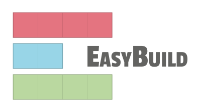
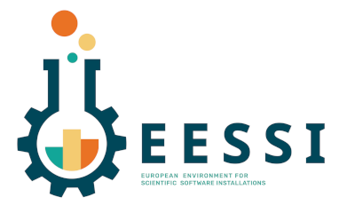

# Introduction

As part of the BioHackathon Europe 2022, we here report the outcomes of the Project #16: **Make your own or favourite software available on your cluster with EasyBuild/EESSI**.

  

The main goals of the project were to introduce users to [EasyBuild](https://easybuild.io/) and [EESSI](https://www.eessi-hpc.org/), to port new software to EasyBuild/EESSI (e.g., the participant’s own or favourite software) - thereby making it available and discoverable to the entire EasyBuild community -, and to convert a Nextflow pipeline into an EESSI pipeline. In parallel we started to build bridges between EESSI and Galaxy to make the scientific software more accessible to researchers in the domain.

## What are EasyBuild and EESI?

EasyBuild is a community effort to develop a software build and installation framework that allows you to manage (scientific) software on High Performance Computing (HPC) systems in an efficient way. As its name suggests, EasyBuild makes software installation easy by automating builds, making previous builds reproducible, resolving dependencies, and retaining logs for traceability. It is also one of the components of the **European Environment for Scientific Software Installations** (EESSI), a collaboration between different European HPC sites and industry partners, with the common goal to set up a shared repository of scientific software installations that can be used on a variety of operating systems and computer architectures. It can be applied in a full size HPC cluster, a cloud environment, a container or a personal workstation.

## EasyBuild and EESSI in life sciences

With the deluge of data in the genomics field (e.g., clinical data) and the concomitant development of new technologies, the number of data analysis software has exploded in recent years. The fields of bioinformatics and cheminformatics follow this same trend with ever more developments to optimize and parallelize analyses. The bioinformatics field is now the main provider of new software in EasyBuild. Developers of those tools are not always professional developers, and they do therefore not always follow best practices when releasing their software. As a result, many tools are complicated to install, making them ideal candidates for porting their installation to EasyBuild so that they become more easily accessible to end users.

# Results

# Discussion

...

## Acknowledgements

...

## Useful links

### Getting started and Slack links

- Getting started with EasyBuild: https://docs.easybuild.io/
- Getting started with EESSI: https://eessi.github.io/docs/
- EasyBuild Slack channel: https://easybuild.io/join-slack
- EESSI Slack channel: https://www.eessi-hpc.org/slack-channel/

### Other links

- EasyBuild homepage: https://easybuild.io/
- EasyBuild community: https://github.com/easybuilders
- EasyBuild last presentations: https://www.youtube.com/c/easybuilders
- EESSI homepage: https://www.eessi-hpc.org/
- EESSI at GitHub: https://github.com/EESSI
- Introductory talk on EESSI:
  - https://archive.fosdem.org/2021/schedule/event/eessi
  - https://eessi.github.io/docs/meetings/2022-09-amsterdam/EESSI-community-meeting-2022.09-001-introduction-to-EESSI.pdf

## References

1. EESSI [@citesAsAuthority:EESSI2022]
