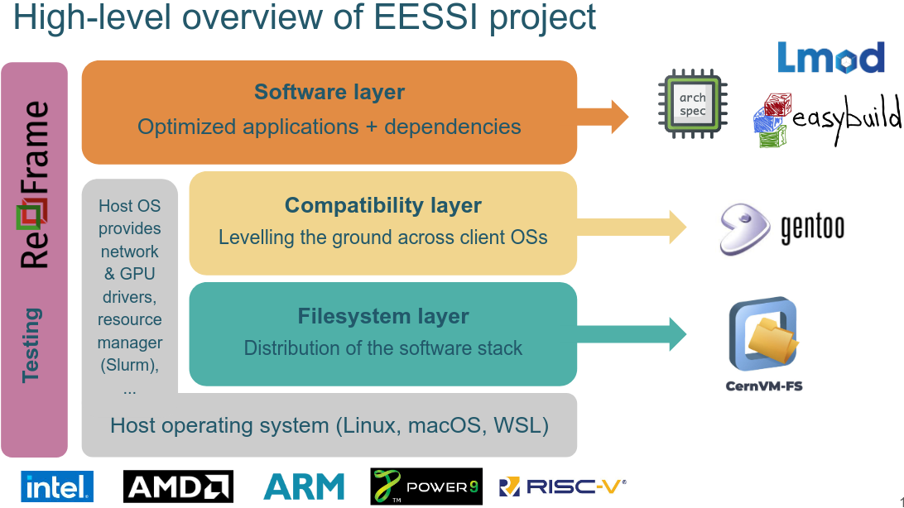
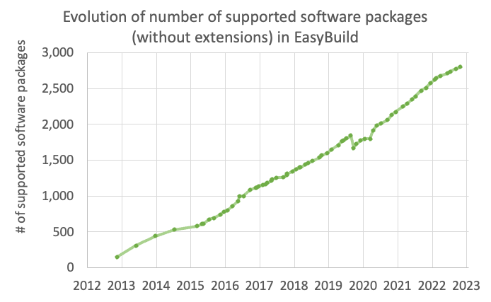
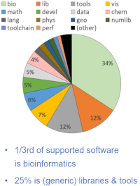

# Introduction

As part of the BioHackathon Europe 2022, we here report the outcomes of the Project #16:

**Make your own or favourite software available on your cluster with EasyBuild/EESSI**.

  

The main goals of the project were to introduce users to [EasyBuild](https://easybuild.io/) and [EESSI](https://www.eessi-hpc.org/), to port new software to EasyBuild/EESSI (e.g., the participant’s own or favourite software) - thereby making it available and discoverable to the entire EasyBuild community -, and to integrate EESSI in a Nextflow pipeline. In parallel we started to build bridges between EESSI and Galaxy to make the scientific software more accessible to researchers in the domain.

## What are EasyBuild and EESI?

EasyBuild is a community effort to develop a software build and installation framework that allows you to manage (scientific) software on High Performance Computing (HPC) systems in an efficient way. As its name suggests, EasyBuild makes software installation easy by automating builds, making previous builds reproducible, resolving dependencies, and retaining logs for traceability. It is also one of the components of the **European Environment for Scientific Software Installations** (EESSI), a collaboration between different European HPC sites and industry partners, with the common goal to set up a shared repository of scientific software installations that can be used on a variety of operating systems and computer architectures. It can be applied in a full size HPC cluster, a cloud environment, a container or a personal workstation (EESSI, 2023).

EasyBuild is part of the software layer component of EESSI (Fig. 1).

## EasyBuild and EESSI in life sciences

With the deluge of data in the genomics field (e.g., clinical data) and the concomitant development of new technologies, the number of data analysis software has exploded in recent years. The fields of bioinformatics and cheminformatics follow this same trend with ever more developments to optimize and parallelize analyses (Fig. 2). The bioinformatics field is now the main provider of new software in EasyBuild (Fig. 3). Developers of those tools are not always professional developers, and they do therefore not always follow best practices when releasing their software. As a result, many tools are complicated to install, making them ideal candidates for porting their installation to EasyBuild so that they become more easily accessible to end users.

# Materials

## New software to port to EasyBuild
Based on feedbacks from BioHackathon users, as well as on BioHackathon project topics, some software of the following categories will be added or updated in EasyBuild:

- Galaxy/Workflow
- Systems Biology
- Cheminformatics
- Phylogeny/Orthology

## Integrate EESSI in a Nextflow pipeline
One of our users works in metagenomics and is interested by the [nf-core/mag](https://nf-co.re/mag) pipeline: **Assembly and binning of metagenomes**.

**nf-core/mag** is a "bioinformatics best-practise analysis pipeline for assembly, binning and annotation of metagenomes". It is composed of about 28 different tools. This complicated pipeline was chosen to illustrate how easy pipelines can be deployed in an optimised version with EESSI.

Missing tools have to be added in EasyBuild, and some tools already in EasyBuild may have to be updated.

# Results

## Introduce EasyBuild and EESSI
During the BioHackathon, EasyBuild and EESSI were presented to different users, with different backgrounds.

## Port new software to EasyBuild
During the BioHackathon the following new tools were added in EasyBuild:

- Galaxy/Workflow tools: [cwltool](https://github.com/common-workflow-language/cwltool)
- Systems Biology tools: [python-libsbml](https://pypi.org/project/python-libsbml/) and [COBRApy](https://opencobra.github.io/cobrapy/)
- Cheminformatics tools: [Chemaxon_marvin](https://chemaxon.com/)
- Phylogeny/Orthology tools: [Godon](https://bitbucket.org/Davydov/godon) and [InParanoid](https://bitbucket.org/sonnhammergroup/inparanoid/)

[Nextflow](https://www.nextflow.io/)(Galaxy/Workflow) required for the EESSI integration in the pipeline was updated to the last version.

So, **7** pull requests!

Suggested by a BioHackathon user of a Galaxy project, a recipe for toil - a workflow engine - was also prepared. [toil](https://github.com/DataBiosphere/toil)(Galaxy/Workflow) deployment in EasyBuild is almost complete, waiting for a fix from the toil main developer.

## Integrate EESSI in a Nextflow pipeline

### Software side
As mentioned previously [Nextflow](https://www.nextflow.io/)(Galaxy/Workflow) was first updated in EasyBuild, and added in the base configuration of EESSI.

Tools from the **nf-core/mag** pipeline not available in EasyBuild were added:

- [NanoLyse](https://github.com/wdecoster/nanolyse)
- [PyDamage](https://github.com/maxibor/pydamage)
- [CAT-BAT](https://github.com/dutilh/CAT)

Some other tools of the pipeline were version- and/or toolchain-updated.

With their requirements, overall, it corresponds to about **20** pull requests, i.e., about **27** software.

An extra pull request was done to bundle the whole pipeline tool list into a single entry point for EESSI.

See pull request details [here](https://github.com/easybuilders/easybuild-easyconfigs/issues?q=label%3ABioHack2022)

### EESSI deployment side
On the EESSI deployment side, a pull request was done to add the pipeline in the EESSI pilot script.

Nevertheless, several issues came out:

- The pipeline was tested in a cloud environment with different architectures. Some of the pipeline tools do not compile easily on some of these architectures.
- Some tools try to force some library usage. This has to be fixed upstream.
- Due to the large number of tools in the pipeline, the build in EESSI for the future deployments takes a lot of time and space.
- It looks the original pipeline - running with containers - has also issues and cannot be run as is.

See pull requests details [here](https://github.com/EESSI/software-layer/issues?q=label%3ABioHack2022)

# Discussion

As part of the ELIXIR BioHackathon 2022 we have introduced EasyBuild and EESSI to the BioHackathon users, extended the number of software in EasyBuild for various categories, and started to integrate EESSI as a Nextflow profile.

The software categories extended during this BioHackathon will continue to have particular attentions in EasyBuild. EasyBuild software will continue to be added and updated by the EasyBuild community.

The integration of EESSI as a new Nextflow profile did not reach our initial goals. All the pipeline tools have been added or updated to EasyBuild, and a bundle was created to add the pipeline tool list as a single entry point in EESSI.
Nevertheless there are still issues to fix to fully integrate EESSI in this Nextflow pipeline, mainly the original pipeline that cannot be run as is, and the architecture issues for some of the tools.
So we were not able to benchmark EESSI vs the original pipeline during the BioHackathon, but our efforts will continue to reach this goal.

## Continuation
Our efforts continue after the BioHackathon:

- [toil](https://github.com/DataBiosphere/toil)(Galaxy/Workflow) has been added in EasyBuild.
- The compilation of some tools on different architectures has been fixed.
- The library usage has been patched.

## Acknowledgements
We would like to acknowledge all users of the BioHackathon for fruitful interactions and advices, as well as the ELIXIR BioHackathon organization team for this great event.

## Useful links

### Getting started and Slack links

- Getting started with EasyBuild: https://docs.easybuild.io/
- Getting started with EESSI: https://eessi.github.io/docs/
- EasyBuild Slack channel: https://easybuild.io/join-slack
- EESSI Slack channel: https://www.eessi-hpc.org/slack-channel/

### Other links

- EasyBuild homepage: https://easybuild.io/
- EasyBuild community: https://github.com/easybuilders
- EasyBuild last presentations: https://www.youtube.com/c/easybuilders
- EESSI homepage: https://www.eessi-hpc.org/
- EESSI at GitHub: https://github.com/EESSI
- Introductory talks on EESSI:
  - https://archive.fosdem.org/2021/schedule/event/eessi
  - https://eessi.github.io/docs/meetings/2022-09-amsterdam/EESSI-community-meeting-2022.09-001-introduction-to-EESSI.pdf

## References

1. EESSI [@citesAsAuthority:EESSI2023]
